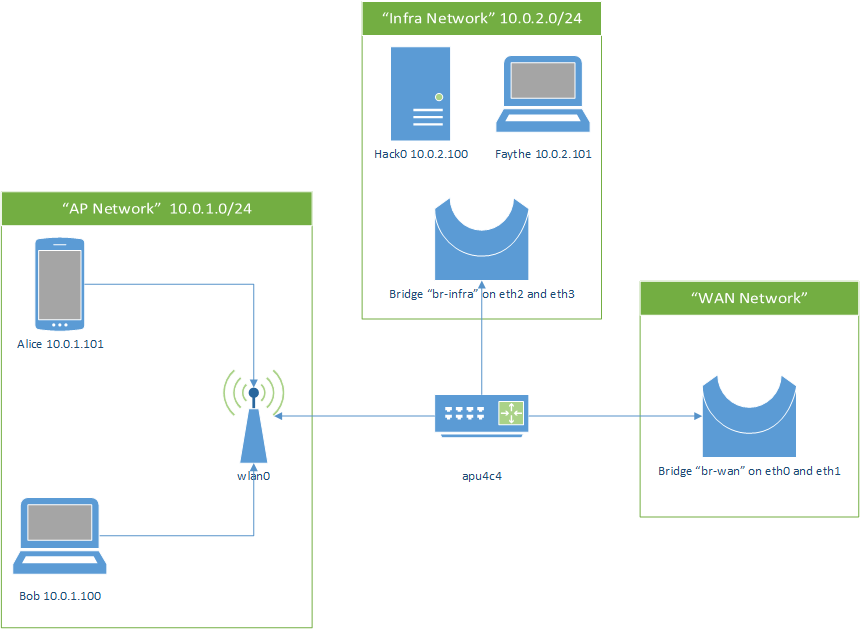

# Hack0-wrt

## Introduction

This project is about building an Open-WRT image for the [apu4c4](https://www.pcengines.ch/apu4c4.htm) board adapted for creating a captive portal powered by BTCPayServer payments.

## How to build

In order to let the user build on the system of his choice, we are building the image on docker.

For convenience, we created `build.sh`, you can use it to build the image in the following way.

```bash
./build.sh build
```

You can see more details on [Dockerfile](Dockerfile).

## How to deploy

Find your device with `lsblk` and run

```bash
./build.sh deploy --deploy-on=/dev/sdX
```

BE CAREFUL, if you use the wrong interface you may format important data.

For more information, use `./build.sh --help`.

## Infrastucture

The hack0-wrt is composed from two devices:
* apu4c4
* hack0

The apu4c4 is a router running a custom image of openwrt built by this repository.
It setup the network with the following infrastructure.

